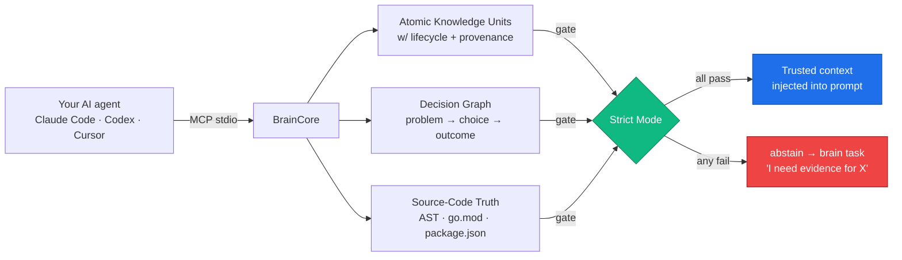
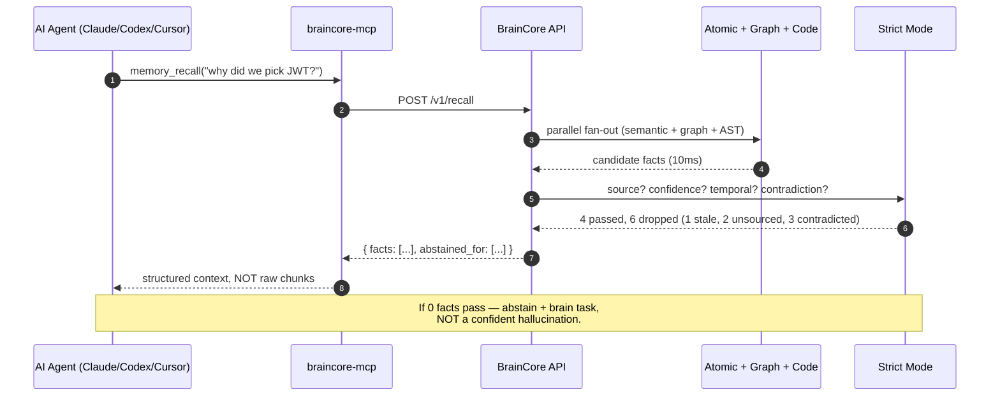

<h1 align="center">BrainCore</h1>

<p align="center">
  <strong>The memory layer that lets your AI coding agent say "I don't know."</strong>
</p>

<p align="center">
  <em>Local-first · 0.95 R@5 · 4ms p95 retrieval · Strict abstain by design</em>
</p>

<p align="center">
  <a href="https://getbraincore.com">Website</a> ·
  <a href="https://getbraincore.com/#pricing">Pricing</a> ·
  <a href="#articles">Series</a> ·
  <a href="#quick-start">Quick start</a> ·
  <a href="https://github.com/vbcherepanov/total-agent-memory">Open-source companion</a>
</p>

<p align="center">
  <a href="https://getbraincore.com"></a>
  <a href="#"></a>
  <a href="#"></a>
  <a href="#"></a>
  <a href="#"></a>
  <a href="https://x.com/BestProgerVR"></a>
</p>

---

## Why this exists — a 3 AM story

It's 3 AM. I'm on my third night debugging an AI coding agent. The agent has confidently rewritten the auth function — based on a chunk that belongs to a branch deleted from the repo two months ago.

The chunk lived in Qdrant. Its cosine similarity was high. Top-1 in retrieval. The agent honestly grabbed it, honestly stitched it into the prompt, honestly generated the "correct" patch — **against code from a different reality**.

I close the laptop and think: *I have RAG. I have vectors. I have long-term memory. Why is my agent fixing code that doesn't exist anymore?*

Because **my agent doesn't have memory. My agent has search results with cosine instead of BM25.** And between those two sentences lies the entire difference between *"AI you can trust in production"* and *"AI you babysit on every line."*

**BrainCore is the layer that closes that gap.**

---

## What BrainCore actually does

BrainCore is a **local-first cognitive memory** that sits between your IDE / coding agent and your codebase. Every fact your agent uses to generate code passes through a **strict-mode gate** before it lands in the prompt — and if no fact survives, the agent says *"I don't know"* instead of inventing one.



Result: an agent that *refuses* to write code based on a deleted file, a deprecated decision, or a hypothetical fact you never confirmed.

---

## The headline numbers

<table>
<tr>
  <td align="center"><strong>0.95 R@5</strong><br/><sub>retrieval recall<br/>at gate threshold 0.85</sub></td>
  <td align="center"><strong>4 ms p95</strong><br/><sub>retrieval latency<br/>across atomic + graph</sub></td>
  <td align="center"><strong>0%</strong><br/><sub>confidently-wrong<br/>actions in bench</sub></td>
  <td align="center"><strong>30%</strong><br/><sub>honest abstain rate<br/>(traded for the 0% above)</sub></td>
</tr>
<tr>
  <td align="center"><strong>11/11</strong><br/><sub>legacy migration tests<br/>green</sub></td>
  <td align="center"><strong>Local</strong><br/><sub>your code never leaves<br/>the box, period</sub></td>
  <td align="center"><strong>MCP</strong><br/><sub>plugs into Claude Code,<br/>Codex, Cursor, Cline</sub></td>
  <td align="center"><strong>Apache-2.0</strong><br/><sub>open companion:<br/>total-agent-memory</sub></td>
</tr>
</table>

---

## The seven principles BrainCore is built on

The full deep-dive is in [Part 2 of the series](#articles). Headlines:

| # | Principle | What it kills |
|---|-----------|---------------|
| 1 | **Atomic Knowledge Units with lifecycle** — `staging → working → consolidated → archived` | Stale chunks parading as current truth |
| 2 | **Strict Mode + right to abstain** — no fact → no answer | "Confident hallucinations" disguised as accuracy |
| 3 | **Causal decision chains** — `problem → alternatives → decision → reasoning → outcome` | Decisions reduced to three flat fragments by the chunker |
| 4 | **AST-based code identity** — symbols, not text | Patches written against deleted branches |
| 5 | **Internal git versioning of memory** — every fact has a commit | "When did we change our mind?" being unanswerable |
| 6 | **Negative memory + rule engine** — what *failed* is first-class | Repeating the same regression you fixed three months ago |
| 7 | **Self-model** — competencies, blind spots, brain-tasks backlog | Agent that pretends to know what it doesn't |

*Each principle in BrainCore corresponds to an explicit Postgres schema + a Go module — not a prompt-engineering trick.*

---

## How a query flows through



The agent receives **decisions and atomic facts**, not chunks. The structure carries the metadata your prompt needs to *reason*, not just *recite*.

---

## Versus other memory tools

|  | BrainCore | Mem0 / Letta / Zep | Generic vector RAG (Qdrant + bge) |
|---|---|---|---|
| **Local-first by default** | Yes — your code never leaves the box | Hybrid / cloud-first | Self-host or cloud |
| **Strict abstain mechanism** | Yes — first-class `abstain` outcome | No — always returns top-k | No — always returns top-k |
| **Causal decision chains** | Yes — explicit schema | Partial / flat | No |
| **Negative memory (failures)** | Yes — rule engine | No | No |
| **AST-based code identity** | Yes — Tree-sitter + symbols | No | No |
| **Self-model + brain tasks** | Yes — backlog of unresolved Qs | No | No |
| **Privacy-conscious deploy** | Single Go binary, native Ollama, optional DeepSeek fallback | Cloud-native | DIY |
| **MCP integration** | First-class, ships `braincore-mcp` | Varies | Bring-your-own |

We don't claim to have invented any single principle. We claim that *all seven have to work in one system at the same time* — and that **a system where only five of seven actually work continues to lie to the user with a confident face**. There's only one way to see this — try assembling all seven into one codebase and watch what happens. That codebase is BrainCore.

---

## Architecture at a glance

```
┌─────────────────────────────────────────────────────────────────┐
│  Your machine — local-first by default                          │
│                                                                 │
│   ┌────────────┐    ┌────────────────────────────────────────┐  │
│   │ Claude Code│    │           BrainCore Daemon            │  │
│   │ Codex CLI  │MCP │                                       │  │
│   │ Cursor     │◀──▶│  ┌─────────┐  ┌─────────┐  ┌────────┐ │  │
│   │ Cline      │stdio│  │ API     │  │ Worker  │  │ Brain  │ │  │
│   └────────────┘    │  │ :8765   │  │ NATS    │  │ Events │ │  │
│                     │  └────┬────┘  └────┬────┘  └───┬────┘ │  │
│                     │       │            │           │      │  │
│                     │  ┌────▼────────────▼───────────▼────┐ │  │
│                     │  │  Postgres 18 + pgvector + RLS    │ │  │
│                     │  │  Redis 7  ·  NATS 2 JetStream    │ │  │
│                     │  └─────────────┬────────────────────┘ │  │
│                     │                │                      │  │
│                     │  ┌─────────────▼──────────────────┐   │  │
│                     │  │ Ollama (host) — bge-m3 1024d   │   │  │
│                     │  │            qwen2.5-coder:7b    │   │  │
│                     │  │   (DeepSeek cloud fallback,    │   │  │
│                     │  │    per-tenant key, encrypted)  │   │  │
│                     │  └────────────────────────────────┘   │  │
│                     └───────────────────────────────────────┘  │
└─────────────────────────────────────────────────────────────────┘
```

**Stack:** Go 1.25 · Postgres 18 (pgvector) · Redis 7 · NATS 2 JetStream · Ollama (bge-m3 + qwen2.5-coder:7b) · Next.js dashboard. Six binaries, all built from one repo: `braincore-saas`, `worker`, `migrate`, `seed-demo`, `braincore-mcp`, plus the `install.sh` MCP wiring.

---

## Quick start

### Option A — Cloud (Private Beta)

We're onboarding **design partners** before opening signups.

```
visit       https://getbraincore.com
request     a Private Beta seat — describe your stack and one painful AI bug
get back    a signed install link + an API key
install MCP curl -fsSL https://getbraincore.com/install.sh | bash
restart     Claude Code / Codex / Cursor
```

Beta seats are free during the design-partner period. **Production pricing** lands when we exit beta — see [getbraincore.com/#pricing](https://getbraincore.com/#pricing).

### Option B — Open-source companion

The local-only memory engine is open-sourced as **[`total-agent-memory`](https://github.com/vbcherepanov/total-agent-memory)** (Apache-2.0). It's the same atomic-knowledge / strict-mode / decision-graph core, minus the multi-tenant SaaS layer and the cloud MCP relay.

```bash
# Coming soon as a public repo with a one-line installer.
# Until then, request access via hi@getbraincore.com.
```

---

## Pricing

| Plan | Per dev / mo | What you get |
|---|---|---|
| **Solo** | **$20** | 1 dev, 3 active projects, local Ollama, MCP for Claude Code / Codex / Cursor |
| **Team** | **$50** | up to 10 devs, shared brain across the team, decision-graph audit, fine-grained RLS |
| **Enterprise** | custom | self-host on your infra, SSO, custom evaluators, SLA |

ROI math we ran with our first design partners: a senior dev burns ≈ 30 minutes a day re-explaining the project to their AI agent. At a $80/hour fully-loaded rate, that's **≈ $880 saved per developer per month**. BrainCore costs ~3% of that.

---

## Articles — the three-part deep dive

The product was distilled from a 9000-word essay series. If you want the *why* before the *how*, read these in order:

| # | Title | What it covers | Read time |
|---|---|---|---|
| 1 | **[RAG isn't memory. It's Ctrl+F with embeddings.](../ARTICLES/part_1_rag_is_not_memory.md)** | Three holes you can drive a truck through in any vector-RAG "memory" stack | 9 min |
| 2 | **[Seven principles of real memory for AI agents](../ARTICLES/part_2_seven_principles.md)** | Architecture, formulas, lifecycle. Why you need *all seven* together. | 12 min |
| 3 | **[The right of an AI agent to stay silent](../ARTICLES/part_3_right_to_abstain.md)** | Why accuracy is the wrong metric. Abstain as a first-class outcome. | 9 min |

Companion publication plan & social copy: [`README_publication_plan.md`](../ARTICLES/README_publication_plan.md).

---

## What this is *not*

- **Not a vector DB.** We use pgvector for one of seven retrieval layers; cosine similarity is a feature, not the product.
- **Not a RAG framework.** RAG is Ctrl+F with embeddings. We treat it as a *primitive*, not a model.
- **Not a chatbot.** BrainCore doesn't generate answers. It *gates* the facts the answer is grounded in.
- **Not a cloud-only SaaS.** Local-first is the default. Your code never leaves the machine unless you explicitly opt into a cloud LLM fallback.

---

## FAQ

**Does BrainCore replace my existing AI agent?**
No. It plugs in via MCP — your agent stays Claude Code / Codex / Cursor / Cline. BrainCore is the layer that decides *what facts the agent is allowed to see*.

**Will my code be sent to a cloud?**
Only if you explicitly enable the DeepSeek fallback for embeddings/chat. Default is fully local Ollama (bge-m3 + qwen2.5-coder:7b on your hardware). The dashboard, the Postgres, the NATS — all on your box.

**What's the difference between BrainCore and `total-agent-memory`?**
`total-agent-memory` is the open-source single-tenant core. **BrainCore** adds: multi-tenant SaaS layer, design-partner onboarding, hosted MCP relay, billing, RLS hardening, audit log. Same memory model, different operational story.

**Will it work with my agent stack?**
If your agent speaks MCP stdio — yes. Verified: Claude Code, Codex CLI, Cursor, Cline (VS Code). Coming: Continue, Gemini CLI.

**Why "BrainCore" and not "AntivirusForAI"?**
The marketing positioning evolved. The internal moat is anti-hallucination via 8-layer factcheck (the 8th layer is *grounding against your real source code* — not against a vector index of comments about that code). The product name kept the cognitive metaphor; the value prop is "your agent finally gets to admit it doesn't know."

**Can I self-host the SaaS layer?**
Enterprise plan only — single-binary deploy, Postgres + Redis + NATS + Ollama, ships in <30 min on a 4 vCPU box. Get in touch.

**Is the codebase open?**
The companion `total-agent-memory` is Apache-2.0 today. The full SaaS stack will open progressively as we exit Private Beta.

---

## Roadmap

- [x] Atomic Knowledge Units with full lifecycle
- [x] Strict-mode gate with explicit abstain
- [x] Causal decision-graph schema
- [x] AST-based code identity (Tree-sitter, 9 languages)
- [x] MCP stdio integration (Claude Code, Codex, Cursor, Cline)
- [x] Native Ollama + DeepSeek fallback
- [x] Multi-tenant Postgres with RLS + per-tenant API keys
- [ ] **Public Beta** — open signup at [getbraincore.com](https://getbraincore.com) (Q3 2026)
- [ ] **VS Code extension** — surface brain tasks in the editor sidebar
- [ ] **GitHub App** — block PRs that contradict committed decisions
- [ ] **Browser-side agent** — same brain across IDE + ChatGPT/Claude.ai
- [ ] **On-prem k8s helm chart** — Enterprise tier

---

## Founder

Built by [**Vitalii Cherepanov**](https://www.linkedin.com/in/progerinvr/) — 18 years of senior backend, 3 years debugging AI agents in production, currently based in Serbia and writing code for New Zealand teams.

- [LinkedIn](https://www.linkedin.com/in/progerinvr/) — engineering posts, weekly
- [X / @BestProgerVR](https://x.com/BestProgerVR) — short takes on AI memory
- [GitHub / @vbcherepanov](https://github.com/vbcherepanov) — open-source companion + side projects
- [hi@getbraincore.com](mailto:hi@getbraincore.com) — design-partner intake

---

## Talk to us

If you've ever shipped a patch your AI wrote against deleted code — we're building this for you.

- **Private Beta intake:** [getbraincore.com](https://getbraincore.com) → "Become a design partner"
- **Email:** [hi@getbraincore.com](mailto:hi@getbraincore.com)
- **Issues / feature requests:** GitHub Issues on this repo
- **Live demo / 30-min call:** book via the website

> *"A good AI agent isn't the one that always answers. It's the one that never confidently does the wrong thing."*
> — from Part 3 of the series

---

<p align="center">
  <a href="https://getbraincore.com">
    
  </a>
</p>
